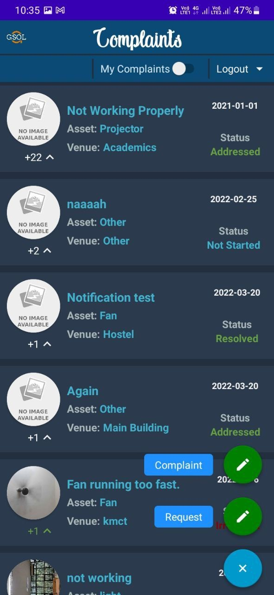
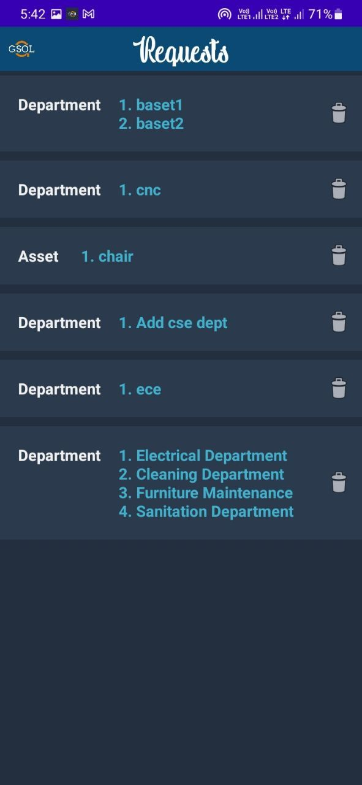
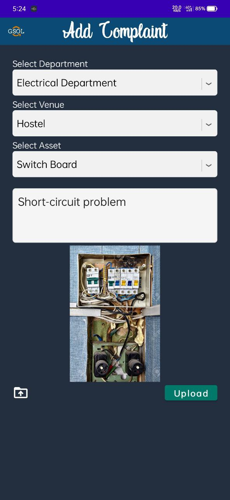
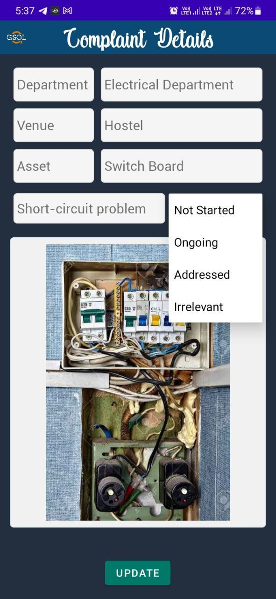
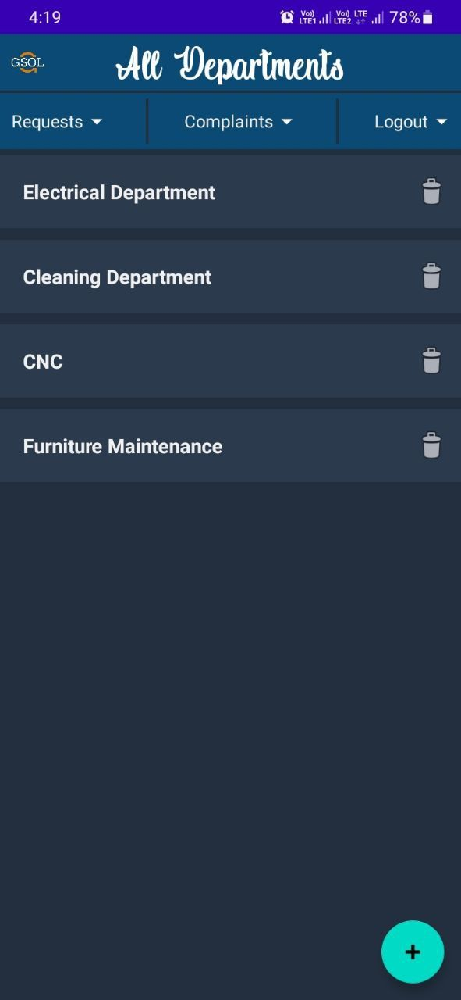
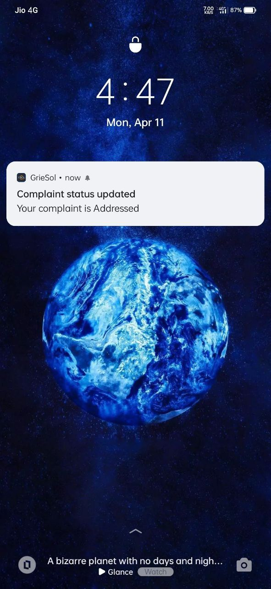

# GrieSol
<div id="top"></div>


<!-- PROJECT LOGO -->
<br />
<div align="center">
  <a href="https://github.com/Pranit4u/GrieSol">
    
  </a>

<h3 align="center">GrieSol</h3>

  <p align="center">
    GrieSol is a android application which will allow students to report their complaints regarding the college assets to the officials. Use your mobile phone to report any issue you are facing in the campus and it will be directly looked by the department officials. 
    <br />
    <a href="https://github.com/Pranit4u/GrieSol"><strong>Explore the docs »</strong></a>
    <br />
   <br />
  </p>
</div>


<!-- TABLE OF CONTENTS -->
<details>
  <summary>Table of Contents</summary>
  <ol>
    <li>
      <a href="#about-the-project">About The Project</a>
      <ul>
        <li><a href="#built-with">Built With</a></li>
      </ul>
    </li>
    <li>
      <a href="#getting-started">Getting Started</a>
      <ul>
        <li><a href="#installation">Installation</a></li>
      </ul>
    </li>
    <li><a href="#preview">Preview</a></li>
    <li><a href="#usage">Usage</a></li>
    <li><a href="#contact">Contact</a></li>
  </ol>
</details>


<!-- ABOUT THE PROJECT -->
## About The Project


GrieSol is a android application which will allow students to report their complaints regarding the college assets to the officials. Use your mobile phone to report any issue you are facing in the campus and it will be directly looked by the department officials.


### Built With

* Android Studio IDE (Frontend)
* Firebase Database
* MongoDB Database
* Node.js (Backend)


<!-- GETTING STARTED -->
## Getting Started

You can install this application to test on your android smartphone.


### Installation

 To download the application go to your chrome browser and copy-paste the download link:
 ```sh
   https://drive.google.com/file/d/1LVmJcxjHIZ0pwZa4qqf1NanRu84PTozV/view?usp=sharing
   ```
   Or
   <br />
   
[Click Here](https://drive.google.com/file/d/1LVmJcxjHIZ0pwZa4qqf1NanRu84PTozV/view?usp=sharing)
 

## Preview
<p align="left">
  <a href="https://github.com/Pranit4u/GrieSol">
    
  </a>
  &nbsp; &nbsp; &nbsp; 
  <a href="https://github.com/Pranit4u/GrieSol">
    
  </a>
  &nbsp; &nbsp; &nbsp; 
  <a href="https://github.com/Pranit4u/GrieSol">
    
  </a>
  &nbsp; &nbsp; &nbsp; 
  <a href="https://github.com/Pranit4u/GrieSol">
    
  </a>
  <br />
  <br />
  <a href="https://github.com/Pranit4u/GrieSol">
    
  </a>
  &nbsp; &nbsp; &nbsp; 
  <a href="https://github.com/Pranit4u/GrieSol">
    
  </a>
  &nbsp; &nbsp; &nbsp; 
  <a href="https://github.com/Pranit4u/GrieSol">
    
  </a>

<!-- USAGE EXAMPLES -->
## Usage

For detail explaination about the application usage, refer to the <a href="https://github.com/Pranit4u/GrieSol/blob/main/GrieSol%20User%20Manual.pdf"><strong> USER MANUAL</strong></a>.


<!-- CONTACT -->
## Contact

Pranit Deshmukh - pranitud@gmail.com

Project Link: [https://github.com/Pranit4u/temp](https://github.com/Pranit4u/GrieSol)

<p align="right">(<a href="#top">back to top</a>)</p>

